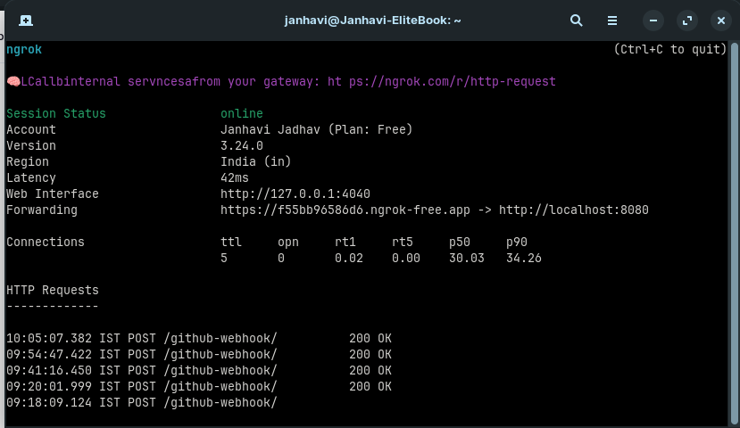
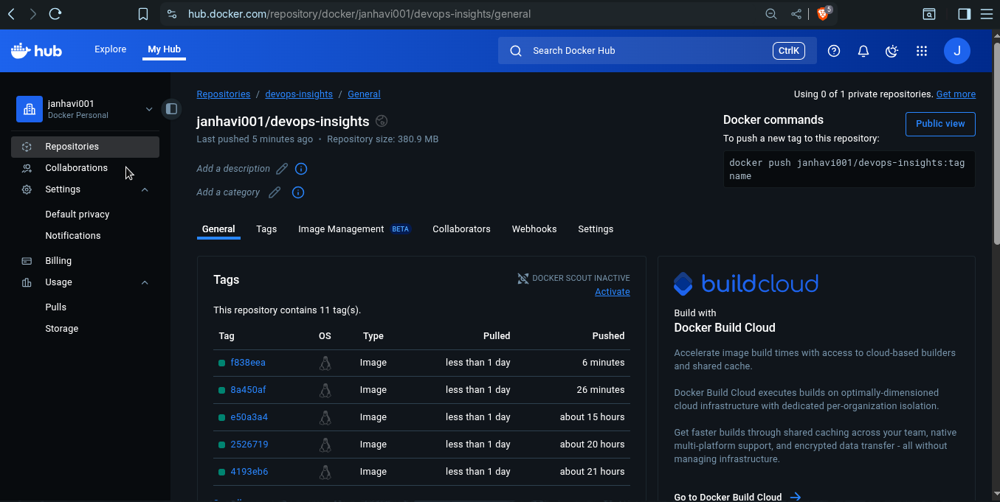
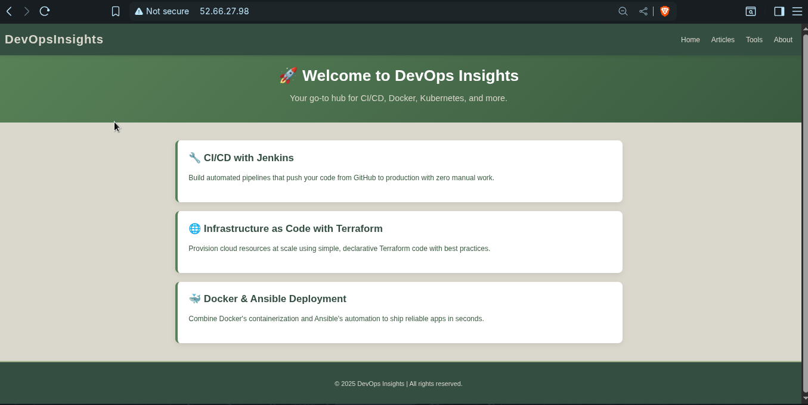

# REPORT.md

## Architecture Diagram

```
+-------------------------+
|      GitHub Repo        |
|  (Code & Jenkinsfile)   |
+-----------+-------------+
            |
            | Push / PR
            v
+-------------------------+
|     GitHub Webhook      |
| → Triggers Jenkins CI/CD|
+-----------+-------------+
            |
            v
+-------------------------+
|         Jenkins         |
|   (CI/CD Pipeline)      |
|       port:8080         |
+-----------+-------------+
            |
            v
+-------------------------+
|        Docker           |
| Build & Push Image      |
| To DockerHub            |
+-----------+-------------+
            |
            v
+-------------------------+
|       Terraform         |
| Provision AWS Infra     |
| - EC2, SG, VPC, EIP     |
+-----------+-------------+
            |
            v
+-------------------------+
|         AWS EC2         |
|   (t2.micro Instance)   |
+-----------+-------------+
            |
            v
+-------------------------+
|         Ansible         |
| - SSH into EC2          |
| - Install Docker        |
| - Pull & Run App Image  |
+-----------+-------------+
            |
            v
+-------------------------+
|     Docker Container    |
|        Node.js App      |
+-------------------------+
            |
            v
+-------------------------+
|  👩‍💻 Website View at     |
|   http://52.66.27.98/   |
+-------------------------+

```

---

## Branching Strategy

- **`main`**: Protected, production-ready branch.
- **`develop`**: Default development branch.
- PRs must go through `develop` → `main`, requiring code review.
- Feature branches are created off `develop`.

```bash
git checkout -b develop
```

---

## Terraform Resource Summary

Terraform (in `infra/`) provisions:

| Resource             | Description                             |
|----------------------|-----------------------------------------|
| `aws_vpc`            | Custom VPC                              |
| `aws_subnet`         | Public subnet in VPC                    |
| `aws_security_group` | Allows SSH (22) and HTTP (80) traffic   |
| `aws_instance`       | EC2 t2.micro with Elastic IP            |
| `aws_eip`            | Static IP for persistent public access  |

Commands:
```bash
cd infra
terraform init
terraform apply -auto-approve
```

Uses input variables:
- `region = "us-east-1"` (or your chosen region)
- `instance_type = "t2.micro"`

---

## Jenkins CI/CD Pipeline

### Jenkinsfile Stages:

1. **Checkout** – Pulls code from `develop` branch  
2. **Build & Push Docker Image** –  
   - Tags with `GIT_COMMIT`  
   - Pushes to DockerHub  
3. **Terraform Apply** –  
   - Provisions EC2 infra  
4. **Ansible Deploy** –  
   - Stops/removes old container  
   - Pulls latest image  
   - Runs new container on EC2

---

## 🧪 Shell Scripting Summary

- **build_and_push.sh** – Builds Docker image with commit tag and pushes to DockerHub
- **cleanup.sh** – Removes unused containers/images/networks from local system

---

## 🌍 Webhook Setup using ngrok

- ngrok started with:
  ```bash
  ngrok http 8080

### Sample Image Tag

```bash
IMAGE="Janhavi001/devops-insights:$GIT_COMMIT"
```

### Trigger Example

Push a change to `src/public/index.js` → merge into `develop` → pipeline auto-triggers.

---

## Shell Scripting & Cleanup

### `scripts/build_and_push.sh`

```bash
#!/usr/bin/env bash
set -euo pipefail

# Get the latest commit short SHA
GIT_COMMIT=$(git rev-parse --short HEAD)
IMAGE="$DOCKER_USERNAME/devops-nodejs:$GIT_COMMIT"

echo "🔧 Building image: $IMAGE"
docker build -t $IMAGE .

echo "🔐 Logging in to DockerHub..."
echo "$DOCKER_PASSWORD" | docker login -u "$DOCKER_USERNAME" --password-stdin

echo "📤 Pushing image to DockerHub..."
docker push $IMAGE

echo "✅ Docker image pushed successfully!"

```

### `scripts/cleanup.sh`

```bash
#Cleanup Old Docker Images (locally or on EC2)
#!/usr/bin/env bash
set -euo pipefail

echo "🧹 Cleaning up Docker images, containers, networks..."
docker container prune -f
docker image prune -f
docker network prune -f

```

---

## Screenshots

### Jenkins Pipeline


### Webhook Status


### Dockerhub pushed images


### Ansible Deployment


### Live App in Browser

